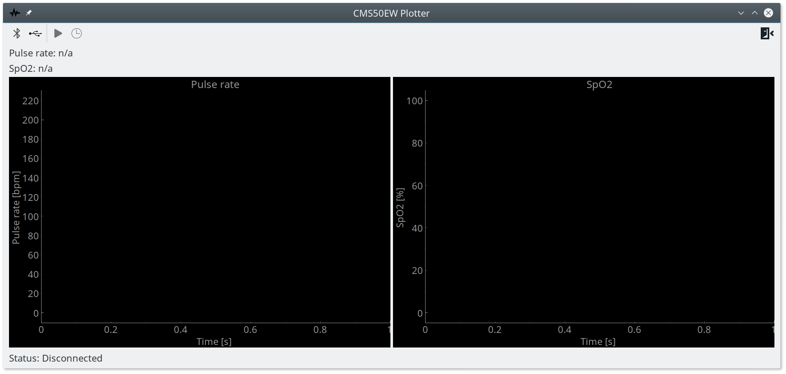
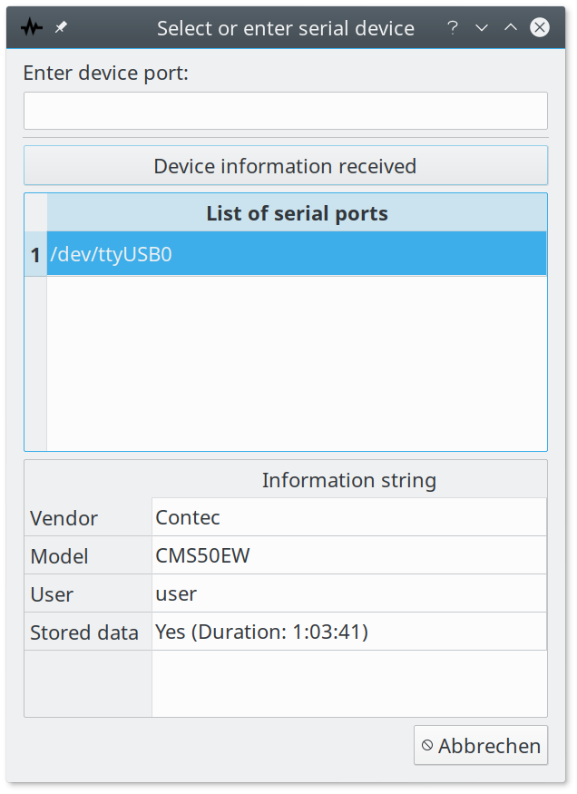
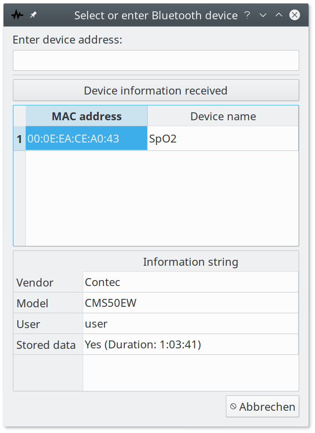
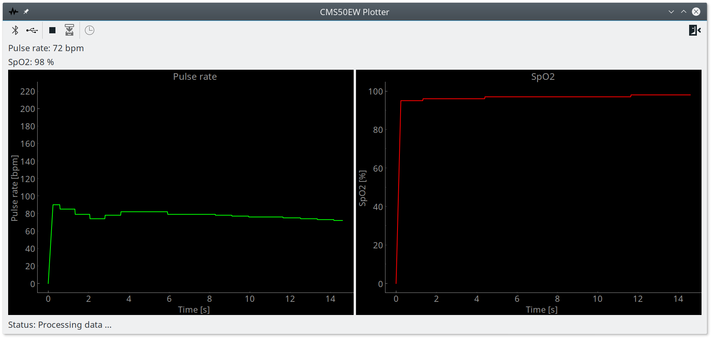
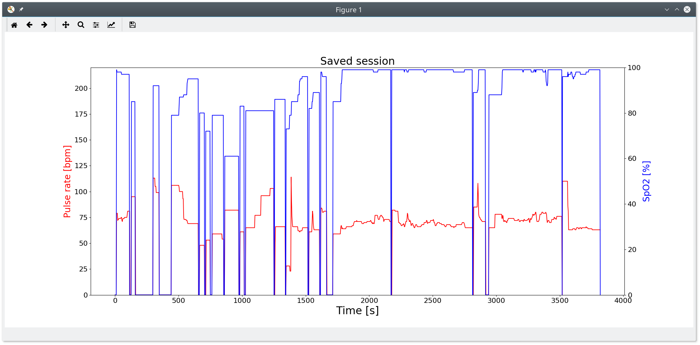
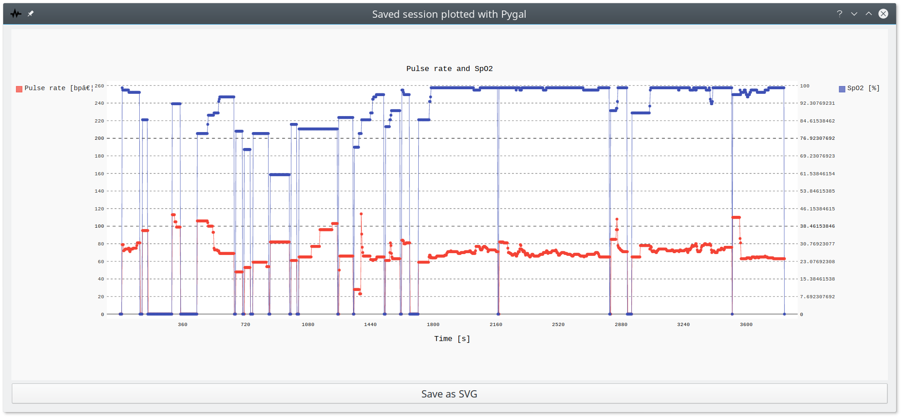
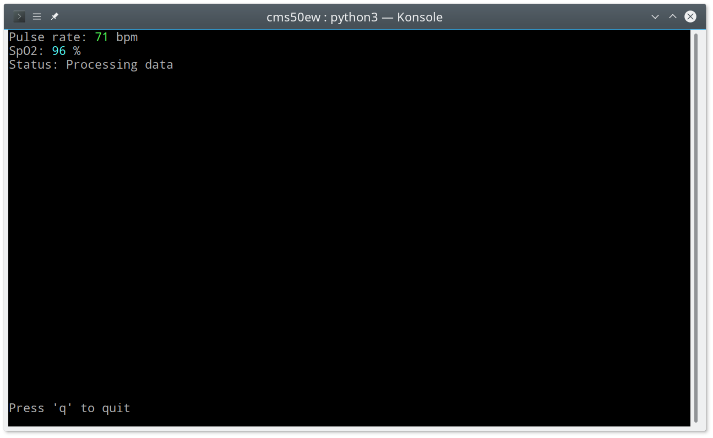

# Python client for Contec CMS50EW pulse oximeter

## Description

The client consists of a CLI (partly using curses) and a GUI (based on Qt5 via PyQt5). Both interfaces are capable of connecting to a CMS50EW device either via USB/serial or Bluetooth, display live data and download recorded sessions. Session data can be saved as a CSV file and plotted using Pygal (export to SVG supported) or Matplotlib.

## Usage (CLI)
usage: cms50ew_cli.py [-h] {live,download} ...

positional arguments:
  {live,download}  specify action to perform
    live           display live data in curses UI
    download       download stored session data

optional arguments:
  -h, --help       show this help message and exit

### Usage for 'live' action
usage: cms50ew_cli.py live [-h] [-b] device

positional arguments:
  device           specify serial port or MAC address of Bluetooth device

optional arguments:
  -h, --help       show this help message and exit
  -b, --bluetooth  specify if connection is to be established via Bluetooth
                   (default is serial)

### Usage of 'download' action
usage: cms50ew_cli.py download [-h] [-b] [--csv file] [--pygal file] [--mpl]
                               device

positional arguments:
  device           specify serial port or MAC address of Bluetooth device

optional arguments:
  -h, --help       show this help message and exit
  -b, --bluetooth  specify if connection is to be established via Bluetooth
                   (default is serial)
  --csv file       store saved data in CSV file
  --pygal file     plot data with Pygal and store it as SVG
  --mpl            plot data with Matplotlib and display it
            
## Examples

### Start Qt5 interface
./cms50ew_qt.py

### Stream live data from a device connected via USB on /dev/ttyUSB0
./cms50ew_cli.py live /dev/ttyUSB0

### Stream live data from a device (MAC address: XX:XX:XX:XX:XX:XX) connected via Bluetooth
./cms50ew_cli.py live -b XX:XX:XX:XX:XX:XX

### Save recorded data to CSV file /tmp/session.csv
./cms50ew_cli.py download --csv /tmp/session.csv /dev/ttyUSB0

### Plot recorded data using Pygal and save plot to SVG file
./cms50ew_cli.py download -b --pygal /tmp/session.svg XX:XX:XX:XX:XX:XX

### Plot recorded data using Matplotlib and display it via Matplotlib's internal viewer
./cms50ew_cli.py download --mpl /dev/ttyUSB0

## Screenshots

### Qt5 interface

### Curses interface

